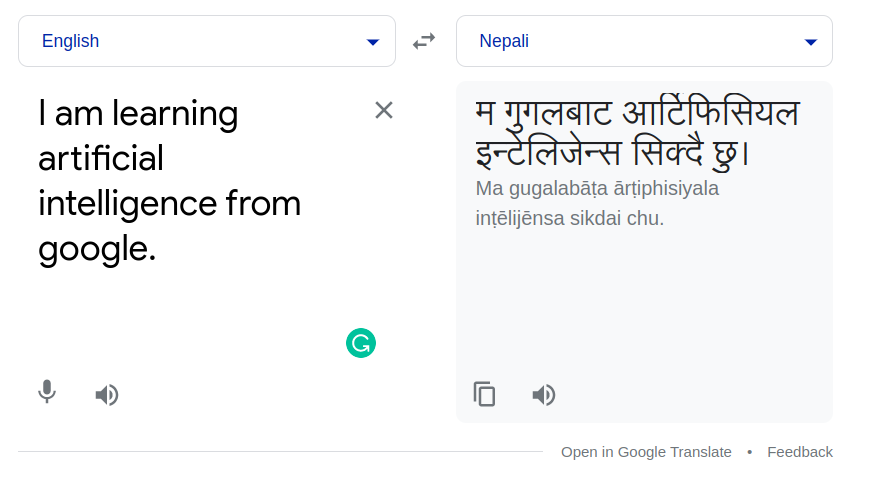
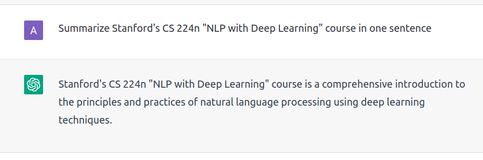
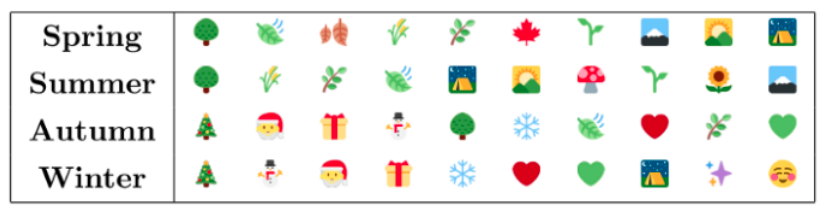
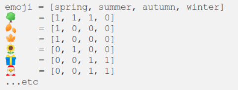
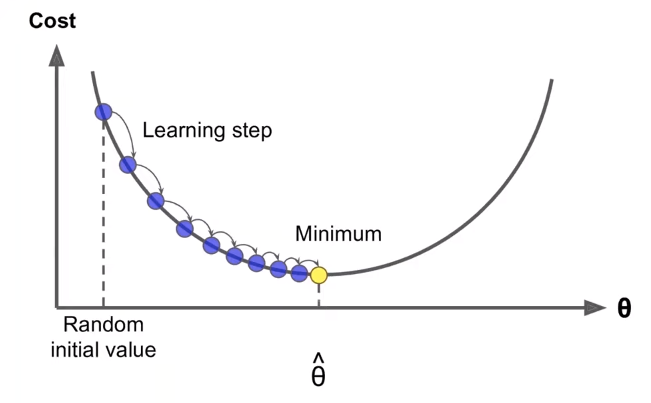
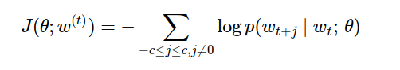
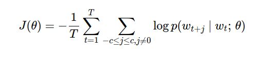
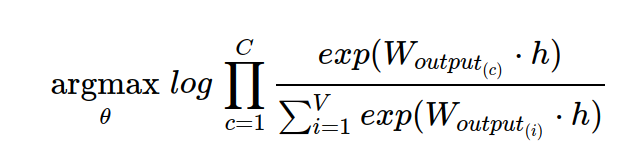
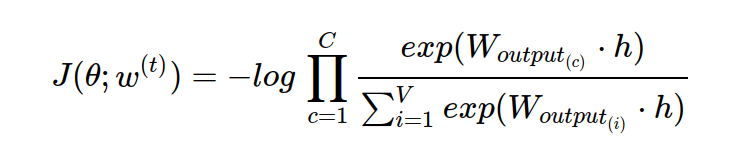

 ## Applications of NLP
- Machine Translation
    - translates from one language to another.
    - It is Ubiquitous
    - Difficulties:
        - Translating long text
- Question answering and information retrieval
- Summarization and analysis of text
- Speech to text
    - Automatic transcriptions of spoken or signed language (audio, or video) to textual representations.
    - It's not in priorities in this course (i.e. in CS224n)

## NLP progress
> Speaker discussed about recent progress in NLP showing real world examples that is used in a daily basis.

1. **Google Translate**
    - a machine translation service developed by Google that can translate text, speech, images, and web pages between any combination of over 100 languages.
    - `Example:`  
    
2. **GPT-3**
    - GPT-3 (Generative pretrained Transformer 3) is a `SOTA` 3rd generation language model developed by OpenAI.
    - It is trained on a large corpus of text data (including books, articles, and web pages) and can generate high-quality natural text in response to prompt.
    - It has wide range of application such as text completion, summarization, translation, and question-answering with very few examples or no explicit training for a specific task.
    - `FINE TUNE on sample data:`

    ```
    **Train Step: FINE TUNE on custom train data (example shown below)**
    train_data1: I broke the window.
    label1: What did I break?  

    train_data2: I gracefully saved the day.
    label2: What did I gracefully save? and so on...
    
    **Test Step: Generate prediction for prompt (using trained model)**

    test_prompt1: I have John flowers.
    model_output1: Who did I give flowers do?

    test_prompt2: I gave her a rose and a guitar.
    model_output2: Who did I give a rose and a guitar to?

    ```
3. **ChatGPT**  
    - ChatGPT is a variant of GPT family of language models, developed by OpenAI which is trained on a large dataset of conversational data, and is able to generate responses that are appropriate to the context and tone of the conversation.
    - In contrast to GPT-3, ChatGPT is designed specifically for use in chatbots and conversational agents, whereas GPT-3 is more general purpose language model that can be used for a wide range of natural language processing tasks and it is not specifically designed for conversation.
    - `Chat GPT interface`: https://chat.openai.com/chat
    - 


## Word Embeddings
> Before diving into NLP word, it is important to understand how we represent textual data which is not understood by the modern computers  . 

- Embeddings methods convert symbolic representation like words, emojis, and other features into meaningful numbers, capturing the underlying semantic relations between them.
- Word embeddings are numerical representation for words that capture their meaning, semantic relationships, and the different types of context they are used in, This enables computers to handle text data and perform various natural language processing tasks (such as text classification, text summarization, Question answering, Named Entity Recognition, etc).
- **Need of Word Embeddings**  
    - Dealing with textual data is problematic, since our computers, machine learning architectures and deep learning architectures cannot process strings or plain text in their raw form. They require numbers as inputs to perform any sort of job, either classification, regression, etc. Word embeddings are therefore necessary to best numerically represent textural input. 

- **Exmple**
    - Let us suppose we have task to compute similarity between emojis. Since computer does not understand emojis symbols directly, then how do we make computer understand about emojis? The answer is we construct emojis embedding, However there may be other approaches as well.
    - Suppose we choose four features `[spring, summer, autumn, winter]` to represent an emoji as a vector with 4 values i.e.
    - 
    - According to above matrix, we can embed each emoji according to the features they posses. It means, Tree emoji is represented by Spring, Summer, and Autumn, so on for others.
    - 
    - Now we can compute emojis similarity (say using Cosine) using the generated emojis vector shown above.

## One hot vectors 
> Assumption: _`Words are independent and unrelated entities`_
- One of the simplest ways to represent words is to consider them as independent and unrelated entities. 
- This can be achieved by creating a set of unique words from a corpus, for example: {..., chatgpt, ..., openai, ...}. 
- This approach provides a single representation for each word regardless of the context in which it is used.
-One way to represent these independent words is through a `One-hot vector` representation. 
    - This method assigns a unique binary vector to each word in a dictionary, where each element in the vector corresponds to a word in the dictionary.
    - The advantage of this representation is that it can be easily processed by a computer, as it transforms textual data into a numerical form.

However, the biggest `drawback` of this type of word representation is that it does not capture the similarity information between words i.e.
 - The dot product of two one-hot vectors representing two different words will always be zero, for example, let v and w be two one-hot vector representations of words, then their dot product will be 0, i.e., v.w = 0 = w.v.

In conclusion, while one-hot vector representation of words can be useful in processing textual data, it fails to capture the semantic relationships between words. This lack of similarity information is a major limitation of this type of word representation.

## Vectors from annotated discrete properties
- It refers to the representation of entities or objects (words in our scenario) as numerical vectors based on their annotated discrete properties or features.
- The objective is to capture the important information about each entity in a numerical format, so that mathematical operations () can be performed on them.
    - Example:
        - Let's suppose we want to generate vector for the word `tea` and assume only `plural noun`, `3rd singular verb`, `hyponynm-of-beverage`, and `synonym-of-chai` as discrete properties for the sake of simiplicity.
        - Vector representation of word `tea` is:  **[0, 0, 1, 1]**
            - Here,
                - 1st vector component = plural noun  
                - 2nd vector component = 3rd singular verb  
                - 3rd vector component = hyponym-of-beverage
                - 4th vector component = synonym-of-chai

- To annotate the information about words, resources such as `WordNet` or `UniMorph` can be used. These resources provide information about various linguistic properties of words, which can be used to generate the vector representations.   
- **Drawbacks:**
    - Human-annotated resources (like WordNet) are always lacking in vocabulary and updating these resources may be costly.  
    - Tradeoff between dimensionality and utility of vectors, 
        - It refers to the size of the vector representation and its usefulness i.e. dimensions can quickly become very large, much larger than size of the vocabulary, inorder to capture all the different categories and properties of the words.
        - Also, such high dimensions sparse vector representations doesn't work well with modern neural networks that tend to operate on dense vectors.
    - Human ideas of optimal text representations tends to underperform when dealing with large amounts of data.

## Distributional Semantics
>The key idea of distributional semantics is that words that occur in similar contexts tend to have similar meanings.   

- Example:  
    - Consider two words i.e. `tea` and `coffee`.
    - Let us suppose word `tea` is present in context such as _drank, the, pot, kettle, bad, delicious, oolong, hot, steam,.....,_.  
    - Since `tea` is similar to `coffee`, hence both of them will have similar distributions of context/surrounding words.
    - For such similar words, set of intersection of their context words will be high.  
- In distributional semantics, words are represented as vectors in a high dimensional space, where dimension corresponds to a feature or property of the words.  
      
## Word Vectors
- word vectors are distributed representations
- Also called as word embeddings or (neural word representations).
- Word vectors are basically a dense vector representation of words, where each components of vector represent some sort of discrete properties asscociated with words with semantic meaning.
- Common dimension of word vectors are: 50, 100, 200, 300  
- **Comparison with One hot Vector**  
    - As discussed above, One hot Encoding assumes words has no semantic meaning, where as word vectors carries semantic meaning.
    - One hot Vector is dependent on Vocab Size i.e. as Vocab Size increases the dimension of  One hot Vector also increases and leads to Sparse Vector, whereas Word Vectors are independent with Size of Vocabulary, and number of dimensions can be tuned as per requirements leading to dense vector.
- **Approaches to Word Vectors Computation**    

    1.`Frequency based Embedding`   
    - BOW, TF-IDF, Co-Occurence Vector  

    2.`Prediction based Embedding`  
    - Word2Vec(CBOW, Skip-Gram), 
    - Glove (Global Vectors for Word Representation)  
    - FastText
        - extension of skip-gram model. Handle out-of-vocabulary words effectively
    - ELMO (Embeddings from Language Models)  
    - BERT Embedding (Bidirectional Encoder Representation from Transformers)  

- **Example:**   
   - Let us consider we want word vector for words: `man`, `woman`, `king`, `queen`.
   - Assume we will use word vector with 4 dimension where,
        - 1st dimension = Gender
        - 2nd dimension = Royal
        - 3rd dimension = Age (adult?)
        - 4th dimension = Food
    
    -   |      Words/Features          | Gender | Royal | Age (adult?) | Food |
        | -------------- | ------ | ----- | ------------ | ---- |
        | Man      | -1     | 0.01  | 0.03         | 0.09 |
        | Woman    | 1      | 0.02  | 0.02         | 0.01 |
        | King     | -0.96  | 0.92  | 0.7          | 0.02 |
        | Queen    | 0.98   | 0.95  | 0.69         | 0.01 |
    - In above table, each rows represent words, and each column represents component/feature of word vector.
    - Using T-SNE algorithm we can visualize above word vectors by projecting 4D vectors to 3D or 2D.
        - You can use [Embedding Projector](https://projector.tensorflow.org/) for ease.


## word2vec
- Word2Vec (_Mikolov et al. 2013_) algorithm works on the idea of Distributional Semantics i.e. the word meaning can be understand by looking at the context it is present.  
- Word2Vec maxmimizes objective function by putting similar words nearby in space. 
- In the process of word vector computation, Word2Vec includes two different algorithms i.e. `CBOW` and `Skip-Gram`.
- `Skip-Gram:`
        - Works well with small amount of the training data.
        - Represents well even rare words or phrases.
        - High computational cost to train.
- `CBOW:`
    - Faster to train than the Skip-Gram model. 
    - Has better accuracy for the frequent words.
    - CBOW model is good choice if training time is big concern, and you have enough training data to overcome the issue of predicting infrequent words.

- **Architecture (Skip-Gram)**  
    - `Input Layer`    
        - The input layer takes the one-hot representation of the center word and passes it to a hidden layer.
    - `Hidden Layer`  
        - The hidden layer receives the input from the input layer and performs matrix multiplication with the weight matrix U.
        - Then output is passed through the activation function to obtain the embedding representation of the center word.
    - `Output Layer`  
        - The output layer receives the embedding representation of the center word and performs a matrix multiplication with the weight matrix V. The result of this multiplication is then passed through a softmax activation to obtain the predicted context words.

- **objective functions**
    - Likelihood in converted to Log likelihood because, 
        - The probability of the data given the parameters (P(X|theta)) is referred to as the likelihood.   
        - rather than working in products, it's easier to work with sums.
        - we want to minimize the likelhood functions, rather than maximizing it so minus sign is present in the objective functions.

- **How to calculate P(wt+j | wt; theta)**
    - we will use two word vectors per word w i.e. we're actually going to give two word vectors for each words.
        - one word vector when it's used as the center word, and a different word vector that's used as a context word.
        - This is done because it's just simplifies the math and the optimization, and makes building word vectors a lot easier

- softmax is a way to convert number to probabilites
    - we use exp because to convert any negative numbers to positive since probability can't be negative.
    
- **Optimization: Gradient Descent**   
    - `Recall:`
        - Gradient Descent is an algorithm to minimize cost function J(&theta;) by changing &theta;
        - From current value of &theta;, calculate gradient of J(&theta;), then take small step in the direction of negative gradient, and Repeat until optimial parameters &theta;.
        - 
        - This is the example when our objective function is convex, but in practice our objective function may not be convex.

    - Update RULE:
        - Update equation (in matrix notation)        
            - _&theta;(new)_ = _&theta;(old)_ - &alpha;&nabla;<sub>&theta;</sub>J(&theta;)
                - here, 
                    - &alpha; is learning rate or step size.
                    - &nabla;<sub>&theta;</sub>J(&theta;) is a gradient vectors obtained by taking gradients of cost function w.r.t parameters &theta;
        - Update equation (for single parameter)    
            - _&theta;<sub>j</sub><sup>new</sup>_ = _&theta;<sub>j</sub><sup>old</sup>_ - _&alpha; * ∂/∂x<sub>i</sub> J(&theta;)_

        - Pseudocode

            ```
            while True:
                theta_grad = evaluate_gradient(J, corpus, theta)  
                theta = theta - alpha * theta_grad
            ```

- **Key points**
    - Word2Vec is a Bag of Words models i.e. they are the models which don't actually pay any attention to word order or position meaning it doesn't matter if you are next to the center word or a bit further away on the left or right and probability estimate will be the same. 
    - Word2Vec maximizes objective function by putting similar words nearby in space i.e. similar words forms a cluster. 
    - According to author, there are two models for Word2Vec i.e. CBOW and Skip-Gram. Skip-Gram model predicts context words given a center word, CBOW model predicts a center word given context words.
    - The training objective of Word2Vec (Skip Gram) is to learn word vector representations that are good at predicting the nearby/context words. 
    - For optimization, Word2Vec assume `stochastic gradient descent` which means for each training sample (center word) <i>w<sup>(t)</sup></i> in the corpus of `T` words , one update is made to the weight matrix say(&theta;)
        - `cost function for stochastic gradient descent`
        - 
        - `cost function for batch gradient descent`
        - 
    - Stochastic gradient descent is preferred over batch gradient descent due to its high computational cost. Since in batch gradient descent one single weight update required processing of the whole corpus, This means computational cost directly proportional to the corpus length.
    - One of the applications of Word2Vec algorithms is to solve `analgoy tasks`.
        - Let say we have three words i.e. `nepal`, `capital`, `kathmandu`
        - Assume, 
            - vec('nepal') = [0.4, 0.6, 0.2]
            - vec('capital') = [0.3, 0.5, 0.1]
            - vec('kathmandu') = [0.6, 0.9, 0.3]
        - Analgoy, `nepal + capital == kathmandu`
            - vec('nepal') + vec('capital') = [0.4, 0.6, 0.2] + [0.3, 0.5, 0.1] = [0.7, 1.1, 0.3]
        - Cosine similarity,
            - cos(vec('kathmandu'), [0.7, 1.1, 0.3]) = 0.998
        - Since, Cosine similarity is very high, we can conclude that the vector addition of 'nepal' and 'capital' is close to the word 'kathmandu'.

## Questions
    - `Why take natural log in the original objective function of Word2Vec algorithms?`
        - Taking natural log simplifies the original objective function in later obtaining the gradients in the process of optimizing weights  
    - `Why use negative log likelhood instead of positive log likelhood in the Word2Vec objective function?`
        - machine learning it's a convention to minimize the objective functions instead of maximizing.
        - So, maximizing positive log-likelihood is equivalent to minimizing negative log-likelihood.
        - `Cost function to maximize`
        - 
        - `Cost function to minimize`
        - 
        - Where, 
            - C = window size, 
            - c = index of context word
            - t = index of center word
            - &theta; = concatenated input-to-hidden and hidden-to-output neural network parameters
            - h = input-to-hidden layer activation
    - `argmax<sub>&theta;</sub> p(x<sub>i</sub>) = argmax<sub>&theta;</sub> ln(p(x<sub>i</sub>)), why?`
        - Taking a log does not affect the optimized weights (&theta;), because natural log is a monotonically increasing function. This means that increasing the value of x-axis results in increasing the value of y-axis. This is important because it ensures that the maximum value of the original probability function occurs at the same point as the log probability function.
    - `Why stochastic gradient descent is preferred over gradient descent in Word2Vec training?`
        - Computationally Efficient:
            - Assume you have training corpus of millions of words.
            - So, if you use Batch Gradient Descent, then you need to loop through all of the words in the training corpus for a single weight update. It means time complexity increases with the increase in the size of training corpus.
            - However, in the case of stochastic gradient descent, it performs weight update by propagating (forward and backward) single word at a time. This means for each single word in the corpus, the weights in the neural network get's updated.
            - This means, SGD is much more computationally efficient than GD, and network converges faster.
        -  Better Generaliazation:
            - The use of stochastic gradient descent can provide better generalization performance as it introduces some level of randomness by randomly selecting training examples at each iteration.
            - This helps to avoid overfitting and improve the model's ability to generalize to new data.  
    - `Why does Skip-Gram model attempt to predict context words given a center word? How does predicting context words help with quantifying words and representing them in a vector space?`
    

    


